# Deprecated
Since Discord.py is no longer supported, this bot will no longer receive bug fixes.

# Freebot
Free, open source Discord chat bot

## Invite
You can invite the bot to your server using this [link](https://discord.com/api/oauth2/authorize?client_id=849325963489181697&permissions=8&scope=bot).

## Prefix
The default prefix of the bot is `!` but it can be changed to anything using the `prefix` command. Do note that the prefix cannot be longer than 5 characters.

<figure>
    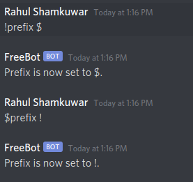
</figure>

## Moderation
The bot currently has basic moderation tools like `ban`, `tempban`, `unban`, `kick`, `mute`, `unmute`, `muted-role`, `autoprofanity`, `addprofanity`, `delprofanity` and `clear`.

### `mod`
Select if to have moderation commands or not. Send `enabled` or `disabled` after the command to specify which one. To view a list of commands, send `help` after the command.

### `ban`
`ban` requires a user and a reason to complete properly. Also requires permissions to ban from the mod and the bot. 

<figure>
    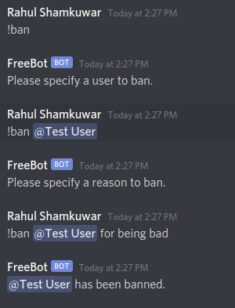
</figure>

If Logs are enabled then you will also find a log post:

<figure>
    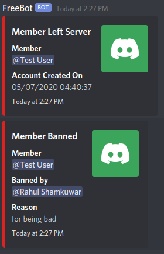
</figure>

### `tempban`
`tempban` requires a user, a duration, and a reason to complete properly. Also requires permissions to ban from the mod and the bot.

<figure>
    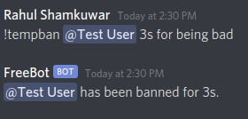
</figure>

If Logs are enabled then you will also find a log post:

<figure>
    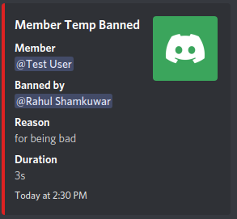
</figure>

### `unban`
`unban` requires a user (usually the easiest way is with the user ID) and a reason to complete properly. Also requires permissions to ban from the mod and the bot. 

<figure>
    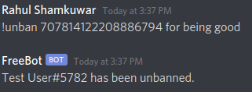
</figure>

If Logs are enabled then you will also find a log post:

<figure>
    
</figure>

### `kick`
`kick` requires a user and a reason to complete properly. Also requires permissions to kick from the mod and the bot. 

<figure>
    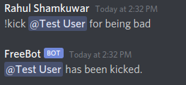
</figure>

If Logs are enabled then you will also find a log post:

<figure>
    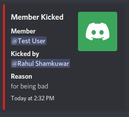
</figure>

### `mute`
`mute` requires a user, a duration, and a reason to complete properly. Also requires permissions to manage messages from the mod and the bot.

<figure>
    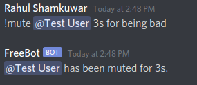
</figure>

Also note that there are checks in case you forget something:

<figure>
    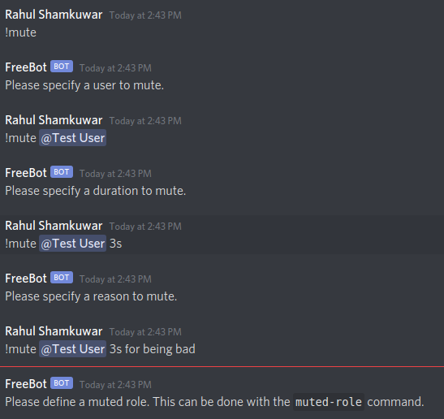
</figure>

Lastly, if there is no muted role specified in the database, please look at `muted-role` to add the muted role.

If Logs are enabled then you will also find a log post:

<figure>
    
</figure>

Note: In order to get logs for roles, look at `logs`.

### `unmute`
`unmute` requires a user and a reason to complete properly. Also requires permissions to manage messages from the mod and the bot.

<figure>
    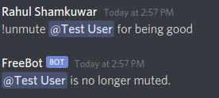
</figure>

### `muted-role`
`muted-role` accepts a role to define as the muted role. If no role is provided, a new one will be created. Also requires permissions to manage messages and manage roles from the mod and manage roles from the bot.

<figure>
    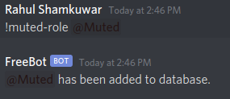
</figure>

### `autoprofanity`
`autoprofanity` will delete any words sent by a user and send a message saying the user cannot say that word. Auto deletes its own message after 5 seconds. The bot will ignore anyone with permissions to manage server. Send `enabled` or `disabled` after the command to specify which one. To view a list of commands, send `help` after the command. Also requires permissions to manage server from the mod. Profanity checks are done with the `better_profanity` library.

<figure>
    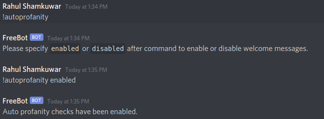
</figure>

<figure>
    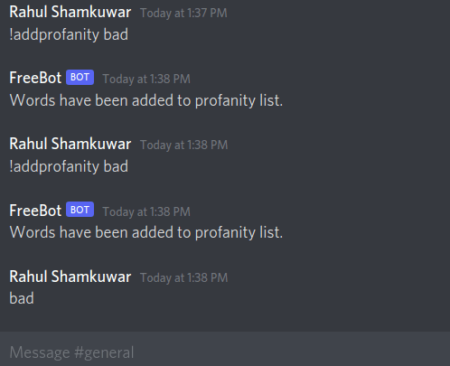
</figure>

### `addprofanity`
`addprofanity` allows you to add a list of words seperated by spaces to the profanity list.  Also requires permissions to manage server from the mod.

<figure>
    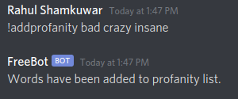
</figure>

### `delprofanity`
`delprofanity` allows you to remove a list of words seperated by spaces from the profanity list.  Also requires permissions to manage server from the mod.

<figure>
    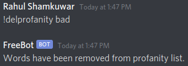
</figure>

### `clear`
`clear` will delete a specified number of messages. It accpets a number that represents how many messages to delete. Also requires permissions to manage messages from the mod and the bot.

<figure>
    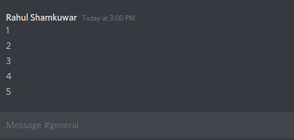
    <figcaption>Ignore how long it looks like I take to type, it's because it's a gif, I promise. </figcaption>
</figure>

## Experience
The bot can keep track of user experience and rank in the guild. It is enabled by default but can be disabled by using `exp`. You can also set up a specific channel to send messages when a user levels up by using `expchannel`. By default the message is sent to the channel where the user's last sent message was. Users can also check their own and other user's rank and level with the `rank` and `level` commands. If you want to remove the channel for exp, you can use `remexpchannel`.

### `exp`
`exp` lets you select if to have experience levels or not. Send `enabled` or `disabled` after the command to specify which one. To view a list of commands, send `help` after the command.

<figure>
    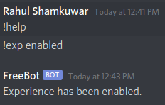
</figure>

<figure>
    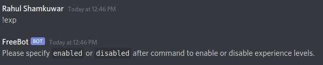
</figure>

### `expchannel`
`expchannel` lets you select which channel to send experience level ups to. Defaults to channel with user's last sent message.

<figure>
    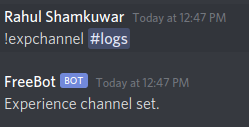
</figure>

<figure>
    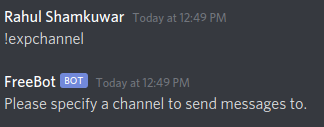
</figure>

<figure>
    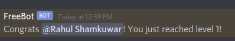
</figure>

### `remexpchannel`
`remexpchannel` Remove the current channel that sends experience level ups.

<figure>
    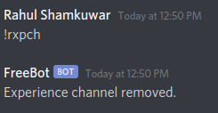
</figure>

### `level`
`level` Display the level of a specified user. If no user is specified the level of the user sending the command will be shown.

<figure>
    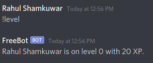
</figure>

<figure>
    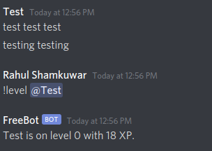
</figure>

<figure>
    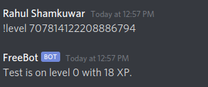
</figure>

### `rank`
`rank` Display the rank of a specified user. If no user is specified the rank of the user sending the command will be shown.

<figure>
    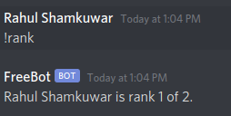
</figure>

<figure>
    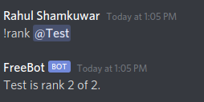
</figure>

## Help
Running `help` will display all commands and how to use them. Running `help <command name>` will show how to use the specific command.

<figure>
    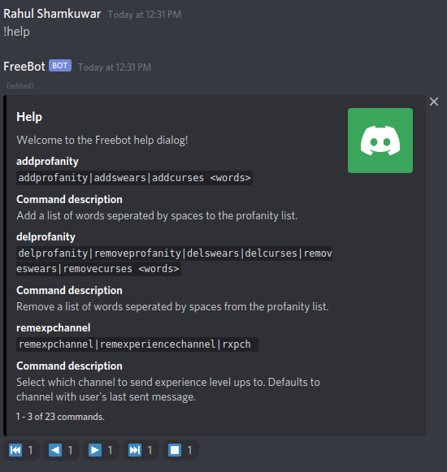
</figure>

<figure>
    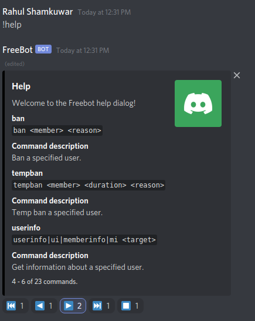
</figure>

<figure>
    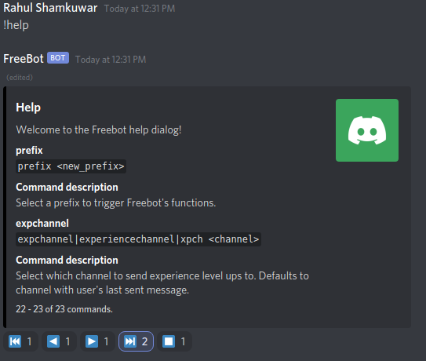
</figure>

<figure>
    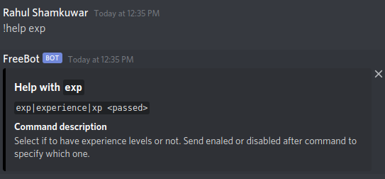
</figure>

## Info
The bot can also show user info and server info with `userinfo` and `serverinfo` respectively. If no user is give for `userinfo` it will show the information of the author of the message.

<figure>
    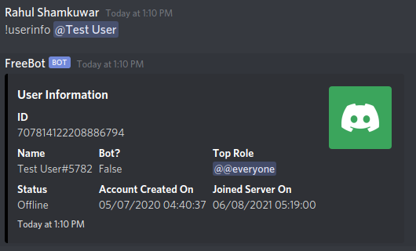
</figure>

<figure>
    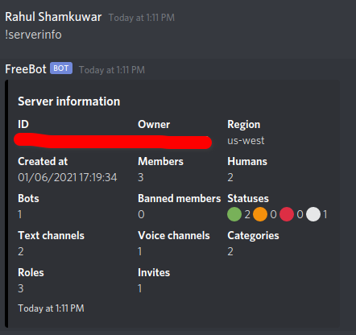
</figure>

## Logs
Logs can be accessed using `logs <enabled | disabled> <channel>` which will show moderation logs, messages that users edited, deleted, when users join and leave the server, and when their nickname or roles changes. Requires manage guild permissions for the mod.

<figure>
    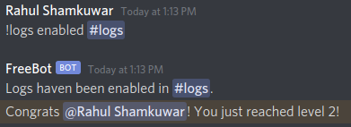
</figure>

Note: level up messages need to be enabled in `exp`

<figure>
    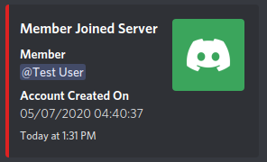
</figure>

<figure>
    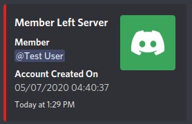
</figure>

<figure>
    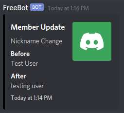
</figure>

<figure>
    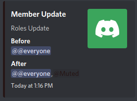
</figure>

## Welcome
The bot can send welcome messages when a user joins the guild and can be accessed using `welcome-message <enabled | disabled> <channel>`. Requires manage guild permissions for the mod.

<figure>
    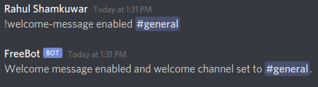
</figure>

## Modmail
The bot also has a modmail feature, I will add pictures soon enough showing how they look, that allows users to open tickets with the moderators of a server.

### `modmail`
Select if to have modmail or not. Send `enabled` or `disabled` after the command to specify which one. To view a list of commands, send `help` after the command.

### `modmailservers`
Get the server ID to send your modmail ticket to by DM-ing the bot.

### `newticket`
Start a new modmail ticket by DM-ing the bot and sending the server ID you want to send a message to.

### `resumeticket`
Resume an old modmail ticket by DM-ing the bot and sending the server ID you want to send a message to.

### `pauseticket`
Pause the current modmail ticket.

### `send`
Use this command to send messages for modmail tickets.

### `asend`
Use this command to send messages anonymously for modmail tickets.

### `edit`
Edit the last sent message in a modmail ticket. I will only check the last 10 messages sent by anyone in the channel.

### `delete`
Delete the last sent message in a modmail ticket. I will only check the last 10 messages sent by anyone in the channel.

### `close`
Close a modmail ticket in the specific channel.

### `aclose`
Anonymously close a modmail ticket in the specific channel.

### `blacklist`
Add a user to a blacklist to block them from using modmail tickets.

### `whitelist`
Remove a user from the blacklist.

## Streaming Notifications
The bot can send notifications for Twitch and Youtube.

### `stream`
Select if to receive stream notifications or not. Send enabled, followed by the channel to ping in, the role to listen to, then the role to ping. Or send disabled after the command. To view a list of commands, send `help` after the command.

## Lastly

I'm going to continue improving this bot for a while so there will definitely be more updates. Also this read me is a work in progress lol, it will be more fleshed out when I'm done. If you wish to help out feel free to open a fork!
